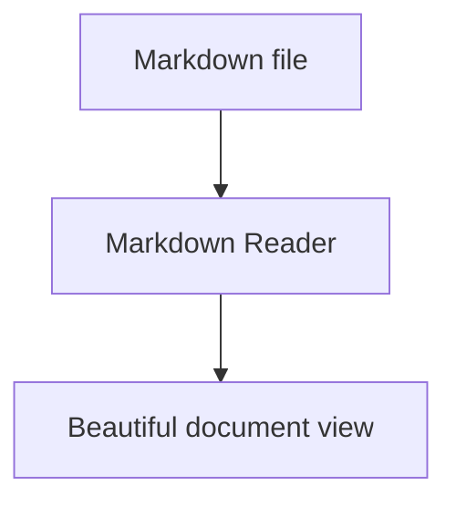

# Markdown support

Markdown Reader aims to support the Markdown features people expect from modern technical documentation.

## GitHub Flavored Markdown

Supported GFM features include:

- headings from H1 to H6
- bold, italic, and strikethrough
- ordered and unordered lists
- nested lists
- task lists
- inline code and fenced code blocks
- blockquotes
- tables with alignment
- horizontal rules
- autolinks

## Code blocks

Code blocks are highlighted using Shiki. The long-term goal is to support language-aware highlighting for 100+ languages, with the active app theme controlling the code theme.

Expected reader features:

- language label
- copy button
- optional line numbers
- safe horizontal scrolling or wrapping

## Mermaid diagrams

Markdown Reader supports Mermaid fenced blocks for common diagram types:

````md

````

````

Target diagram types include flowcharts, sequence diagrams, ER diagrams, Gantt charts, class diagrams, state diagrams, pie charts, and git graphs.

## Math

Inline math uses single dollar signs. Block math uses double dollar signs.

```md
Inline: $E = mc^2$

Block:
$$
a^2 + b^2 = c^2
$$
````

## Callouts

Markdown Reader supports documentation-style callouts:

```md
> [!NOTE]
> Useful information for readers.

> [!WARNING]
> Something the reader should be careful about.
```
